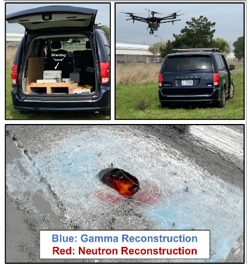
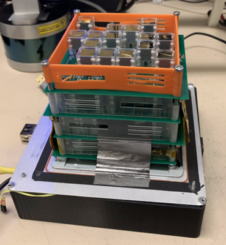
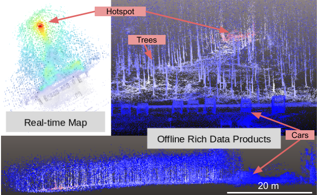
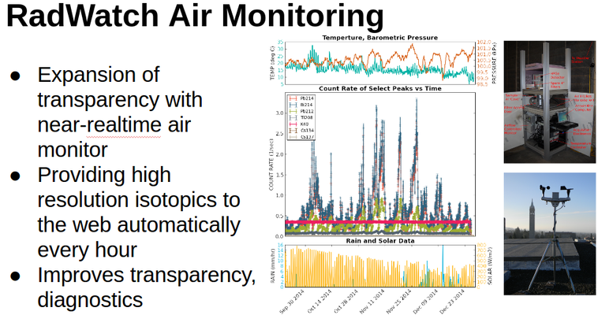
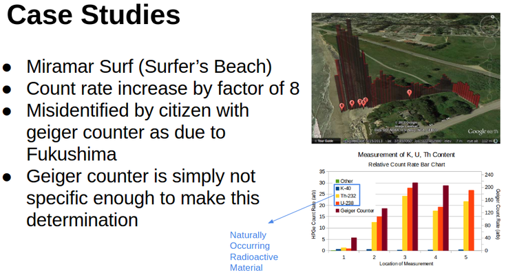

# rtpavlovsk21.github.io
## Who I am
I am a radiation detection scientist and engineer. I generally focus on hardware improvements for multichannel radiation detector systems, however I try to work on difficult problems that have large impact.

## Previous work

My experience generally focuses around high performance radiation detection systems. These systems need to have specificity, sensitivity and directionality as fundamental inputs to the radiation detection problem. 

Specifically my work has focused on creating, designing and building unique radiation detector instruments for 3D radiation mapping in real-time. These systems present unique challenges in all areas of mechanical, electrical and scientific investigation. 

NGLAMPv1 flight and first data products |
:--------------------------------------:|
 |
The photo demonstrates the ability of NGLAMP to fly on a small unmanned aerial system (sUAS) and perform simultaneous neutron and gamma-ray mapping. This demonstration shows a sheilded neutron source, concealed in its gamma-ray signature by heavy sheilding. Therefore the expected and observed result is a neutron-based localization with a uniform gamma-ray background. Read the seminal,  paper on this system. Additional context is provided in the LAMP  paper. |

MiniPRISM internals		| MiniPRISM dispersed contamination measurement
:-----------------:|:--------------------------------------------:
 This image shows the 64 detector semiconductor detector array that MiniPRISM which composes MiniPRISM. The detectors are semiconductor single crystal volumes that are 1cm x 1cm x 1cm. Please watch for our Arxiv publication on this system which flies on sUAS and can be hand-carried.| The above is a data collection in Fukushima Prefecture, Japan which shows a data product from a newly constructed parking-lot and adjoining forested area. The system is hand-carried in this case, as flying sUAS internationally is a bit of a trick! This measurement shows that contamination is found in the low-lying areas sloping away from the newly constructed parking-lot.

RadWatch Measurements and Outreach |
:------------------------------:|
 |
Radioactivity in the air from Naturally Occurring Radioactive Materials (NORM) is found to have large weather variance due to a few factors: air current directionality, precipitation and humidity. In Berkeley for example, air from mainland sources tends to accrue more radon products than winds from the sea. Additionally rain washes out radon through charge neutralization and physical means. The above image is a time-series plot of radioactivity from specific isotopes in a planar high-purity germanium detector that I helped put online.  continues to educate and teach about natural sources of radioactivity and improve accessibility to high quality people from the University of California Berkeley. |
 |
