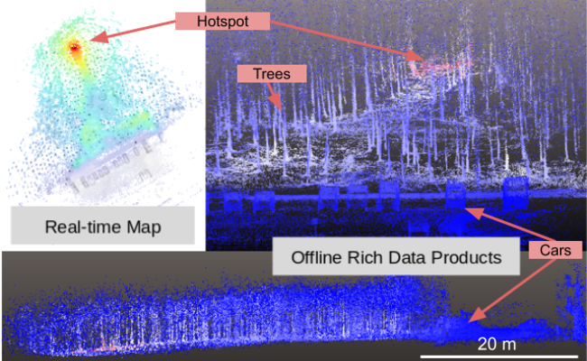

# rtpavlovsk21.github.io
## Who I am
I am a radiation detection scientist and engineer. I generally focus on hardware improvements for multichannel radiation detector systems, however I try to work on difficult problems that have large impact.

## Previous work
NGLAMPv1 flight and first data products |
:--------------------------------------:|
|

MiniPRISM internals		| MiniPRISM dispersed contamination measurement
:-----------------:|:--------------------------------------------:

This image shows the 64 detector semiconductor detector array that MiniPRISM which composes MiniPRISM. The detectors are semiconductor single crystal volumes that are 1cm x 1cm x 1cm. |
The above is a data collection in Fukushima Prefecture, Japan which shows a data product from a newly constructed parking-lot and adjoining forested area. 
